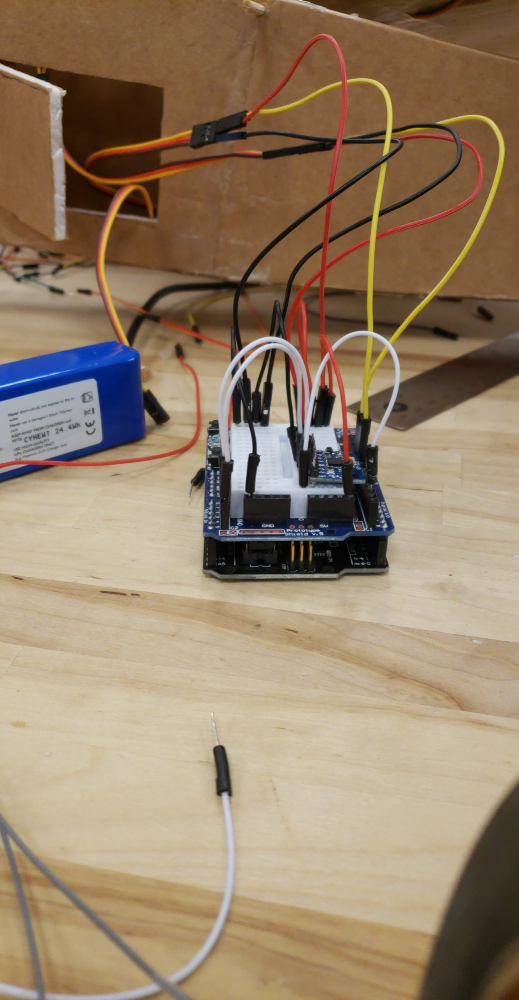
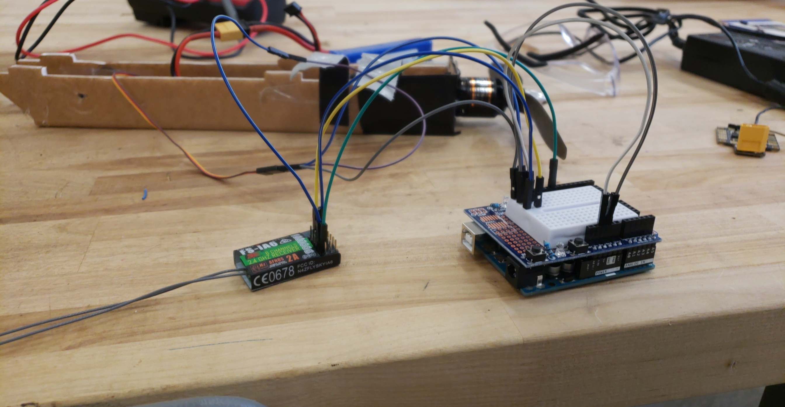

# fc
This project is a flight controller that I programmed during the second semester of my computer science degree. I utilized an arduino to read/write data to/from multiple servos, an accelrometer/gyroscope, and a motor to control a planes movements. I didn't complete the code for the motor and lost portions of the code for the accelerometer module as I had not quite learned how to use git and had only saved the code locally, but I have included the only file I could recover. 

The arduino wired to the servos and accel/gyro module

Arduino wired to the motor - was developing a way to automate the planes takeoff capabilities.

And finally, the servo_controller in action :)

